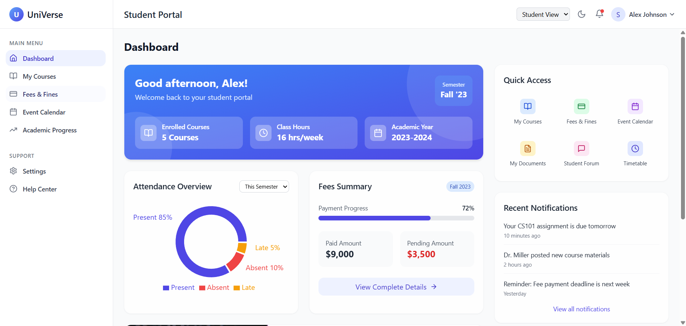
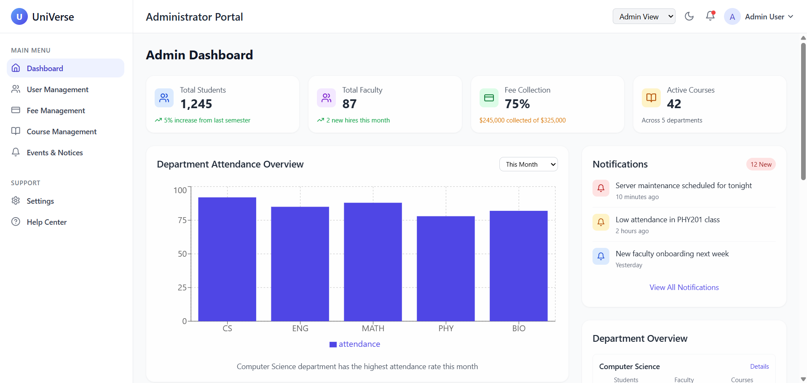
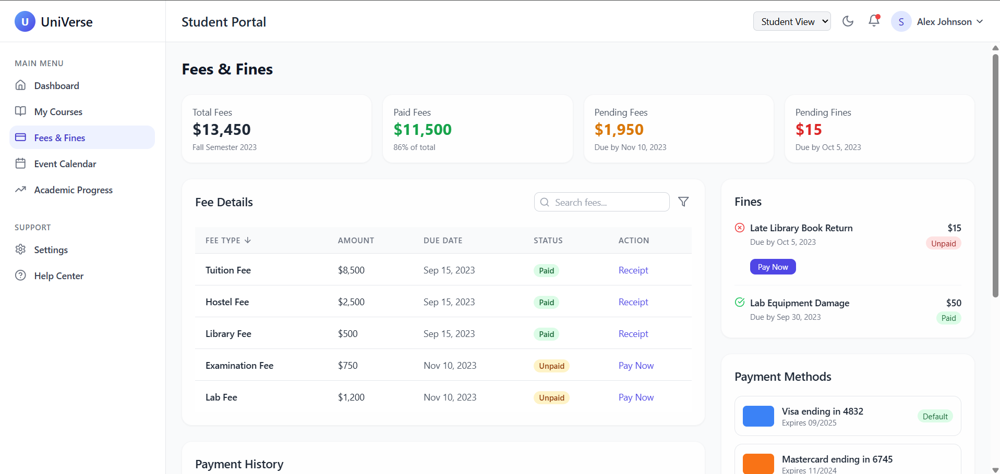
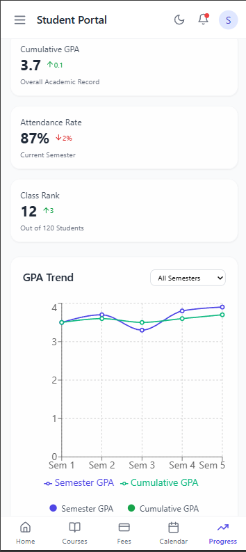

# University Management Platform 🎓

A modern frontend **Fully** **responsive** ui design application for managing university-related activities such as student records, academic modules, exam tracking, and announcements — built using **React**, **Tailwind CSS**, and **TypeScript**.


## 🛠 Tech Stack

- **React.js** (with TypeScript)
- **Tailwind CSS**
- **React Router DOM**
- **Component-based architecture**
- **Vite** (for fast builds)
- **TypeScript** (for type safety)

---

## 🚀 Features

- 📋 **Student Management**: View and manage student data with structured UI.
- 📚 **Academic Modules**: Categorized section for syllabus, schedules, and subjects.
- 🧪 **Exam Tracking**: Display of exam dates, formats, and statuses.
- 📢 **Announcement Panel**: Dynamic area for university-wide notices and alerts.
- 📱 **Responsive UI**: Fully optimized for mobile, tablet, and desktop.

---


```bash
git clone https://github.com/Bharatgwl/University-Management-Platform
cd University-Management-Platform
npm install
npm run dev
```


## 📸 Screenshots


### 🎯 Dashboard View


### 👨‍💼💼 Admin Panel


### 📢 Fee_structure Panel


### 📢 student_portal



